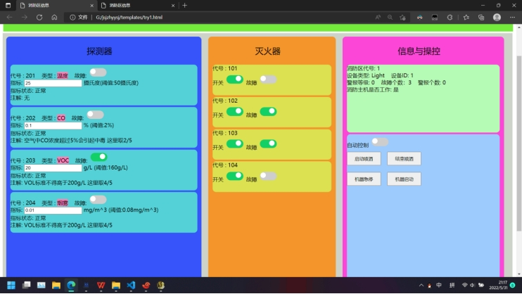

# 自动消防控制系统（模拟）

## **0 前言**

这是一门不上课只有课程设计的课程。

在此之前，完全没碰过web，也完全没碰过后端服务器，拿到这个固定题目的时候还是棘手的，不过好在最基本的web知识不难，而且可以马上进行应用，服务器学一点简单的也就基本能用了。整体来说这个课设在学习上对我的帮助是很大的，但它确实很烂。（尤其是js代码雀氏太烂了，刚开始写只考虑能用，好多基本机制都不清楚，其实有好多地方可以优化，大优化）

**再次声明：很烂，不过对我个人来说有一定的意义。**

## **从这句话下面开始，内容都是我直接从课程设计报告里复制的，不想改乐（**

## **1 项目描述**

课程设计，自动消防系统，主要有以下功能：

首先人为把需要进行消防的大区域划分成若干消防区，这个数字是不固定的，消防区可以动态添加或减少，每个消防区配备温度、CO、VOC、烟雾传感器设备和若干喷洒灭火器，并配备一台消防主机，消防主机可以读取传感器获取的信息判断本消防区的警报等级，并根据警报等级自动开启或关闭喷洒灭火器。另外，消防主机还需要有手动控制、机器急停、机器开启等功能。

一台转发主机可以服务于一台或多台较近的消防主机。转发主机可以读取消防主机的实时信息，并汇总上报给储能工控上位机，交互报文要使用事先设计好的通信协议。

储能工控上位机负责接收转发主机发来的消息，并把正确接收的消息存入数据库，并发送肯定回复，当消息错误时，储能工控上位机需要回复错误报文，相应的转发主机需要马上重传目前最新消息。

观察人员可以通过网页看到任何一个消防区的实时消息，也可以查询任何一个消防区在某一段时间的消息记录。

## **2 问题及软件架构分析**

***\*问题分析:\****

项目中涉及彼此独立的三大主要实体：消防主机，转发主机，储能工控上位机。

我们考虑用web前端模拟所有消防主机的行为，让转发主机作为web后端，前端与后端的数据交互可以体现出消防主机和转发主机的数据传递。每个web前端页面都作为一个独立的消防区。

考虑在另一台服务器上开启数据接收和数据库操作进程，与web后端进程进行数据交互，体现出转发主机和储能工控上位机的数据传递。

其中，一个web后端进程(转发主机)可以对接一个或多个web前端(消防主机), 一个数据接收和数据库操作进程(储能工控上位机)须要能够对接多个web后端(转发主机)。

***\*架构分析:\****

web后端以python语言实现，基于flask框架。

web前后端的交互基于http协议。

数据接收和数据库操作进程和web后端，通过socket实现UDP通信

实时监控和查询功能，同样使用flask框架，采用ajax技术实现局部更改。

***\*概念图:\****

如下图所示。

 

## **3 系统结构设计**

***\*后端代码目录结构:\****

***\*|--- pybase\****

***\*|\****	***\*|--- databaseOperator.py\****

***\*|\****	***\*|--- dataformer.py\****

***\*|\****	***\*|--- dataSR.py\****

***\*|--- templates\****

***\*|\****	***\*|--- xxx.html（若干）\****

***\*|--- static\****

***\*|\****	***\*|--- xxx.css / xxx.js（若干）\****

***\*|--- try1-top.py\****

***\*|--- try1-top-falsk.py\****

***\*|--- try1-web-falsk.py\****

***\*|--- cfg.py\****

***\*pybase目录：\****

pybase目录用于存放实现本课程设计手写的模块，共有三个：

databaseOperator.py是数据库操作模块，里面封装好了后端对数据库操作的各种函数；

dataformer.py是报文编辑模块，可以将转发主机读取到的各种信息转化为实现规定好的报文，也可以让储能工控上位机把收到的报文转化为可读的数据；

dataSR.py是数据发送和接收模块，这个模块通过socket实现了UDP信息的发送和自动接收。

***\*templates和static目录：\****

templates目录和static目录用于存放html、css、js文件，以及网页需要的图片等其他文件。

***\*根目录其他内容：\****

***\*t\****ry1-top.py 实现储能工控上位机数据接收和数据库操作功能。

try1-top-falsk.py 实现储能工控上位机远程查询功能后端。

try1-web-falsk.py 实现转发主机web后端。

(这三个脚本可以根据需要，分配到各个主机。)

cfg.py 配置信息文件。

## **4 项目主要问题**

***\*定义消防主机自动评判警报等级的标准:\****

若只有温度超过阈值(50摄氏度)，设置警报等级为1，不喷洒。

若温度未超标，但任意有毒气体(烟雾归类于有毒气体)指标超过阈值，设置警报等级为2，不喷洒。

若温度和任意一种有毒气体超过阈值，设置警报等级为3，启动喷洒。

***\*消防主机的模拟实现以及逻辑：\****

每个独立的网页(需要在js代码的配置项中更改分区号)都可以模拟一个消防区，消防区没有数量限制，也可以动态增加减少。

外界信息用若干web输入框中的内容代表，用户可以自己输入外界数据。灭火器的开关，以及灭火器和探测器是否故障用若干switch按钮表示。

警报信息、喷洒信息、机器工作信息、消防区代号、故障个数和类型等数据都实现了可视化显示。

消防主机的内部逻辑写在js代码中，可以实现灭火器按钮、警报显示、喷洒显示等可视数据随着输入框数据的改变实时自动更改，也实现了手动模式开关，手动改变灭火器喷洒状态、手动改变所有灭火器喷洒状态、机器急停、机器启动等功能。

当“自动控制”按钮开启时，消防主机进行自动控制，手动控制无效。当该按钮关闭时，消防主机不再进行自动控制，操作者可以通过点击“启动喷洒”或“结束喷洒”按钮手动控制灭火器。

当“机器急停”按钮被按下后，起到处理数据和控制作用的消防主机会停止运行。灭火器无法由于消防主机的控制而开启或关闭。探测器的数据依旧正常实时显示，但消防主机部分的显示数据也不会更新。当“机器启动”按钮被按下时，消防主机功能恢复。

***\*消防主机和转发主机之间的数据流动方式和逻辑：\****

正常情况下消防主机每五秒钟(时间可以调整)，通过POST请求将自身数据上传给转发主机，数据会被打包成json格式置入POST请求头中。

当“机器急停”按钮或“机器启动”按钮被按下时，消防主机立刻向转发主机上传一次自身数据。

***\*报文编辑：\****

按照实现规定好的报文格式，将数据编辑为报文，解析时同理。

这部分技术含量低但代码量大，需要进行大量测试，以保证报文的正确性和完整性。

曾经手写完成DES密码库，通过DES对数据进行加密，但由于DES会对报文进行补全，增加错误检测的难度，出于时间考虑，最终搁置。

为了更好的体现出事件的发生时间或先后顺序，避免遇到网络拥堵的消息早到带来的一些时间错误，报文额外增加了时间戳项目，标识转发主机发送数据时的时间。

编辑好的报文以utf-8格式的二进制编码，通过socket实现的UDP协议在转发主机和储能工控上位机中流通。

***\*关于对程序收到错误报文的处理方式的验证：\****

由于数据在传输过程中出错的概率非常低，很难发生，所以考虑在转发主机的代码中加入定时发送错误报文的功能。每过一段时间，当转发主机将要发送报文时，手动把一段报文的CRC校验码(或其他可以出错的部分)更改。这样转发主机可以收到否定回复，并把最新数据重传。

注：错误重传函数在额外线程中，并不影响主线程正常上传数据。

***\*数据库处理类:\****

提前编写好数据库处理操作需要用到的指令，在进行数据库操作时直接调用类中方法，变量通过参数传入。

数据库需要提前建好表，并赋予角色权限，由程序自动操作。

***\*储能工控上位机接收数据并操作数据库时遇到的问题：\****

安全起见，储能工控上位机对数据的操作时同步的，这导致了它无法同时处理多个转发主机发来的数据，解决方法是，采用多线程实现储能工控上位机接收数据并操作数据库的功能。一个线程专门接收数据，并把数据置入消息队列。一个线程循环从消息队列中提取数据，解析数据，并执行数据库操作。

***\*消防区状态实时查看和查询历史记录功能的实现逻辑:\****

监视者打开监视页面后，可以通过输入消防区的代号来实时查看某个消防区的信息。在这个过程中，监视页面会每个三秒(可以修改)对储能工控上位机上的web后端发送一次POST请求，web后端则执行查询数据库的操作，把指定消防区最新的消息传给监视页面，然后监视页面就可以通过ajax技术对网页进行局部修改，达到实时更新数据的目的。

监视者还可以在时间输入框中输入开始时间和截止时间，对特定消防区进行历史记录的查询。此时监视页面会把监视者要查询的数据通过POST请求传给储能工控上位机的web后端，并接受web后端查询数据库后反馈的结果呈现在页面上(有滑动条)。

 

# **6 项目实现结果**

消防主机(如图2图3)

图2

图3

 

 

分区查询(如图4)

图4

 

 

历史记录查询(如图5)

图5

 

 

 

数据接收和数据库处理(如图6)

图6

 

 

远程查看功能的web后端(如图7)

图7

 

 

 

转发主机web后端(如图8)

图8